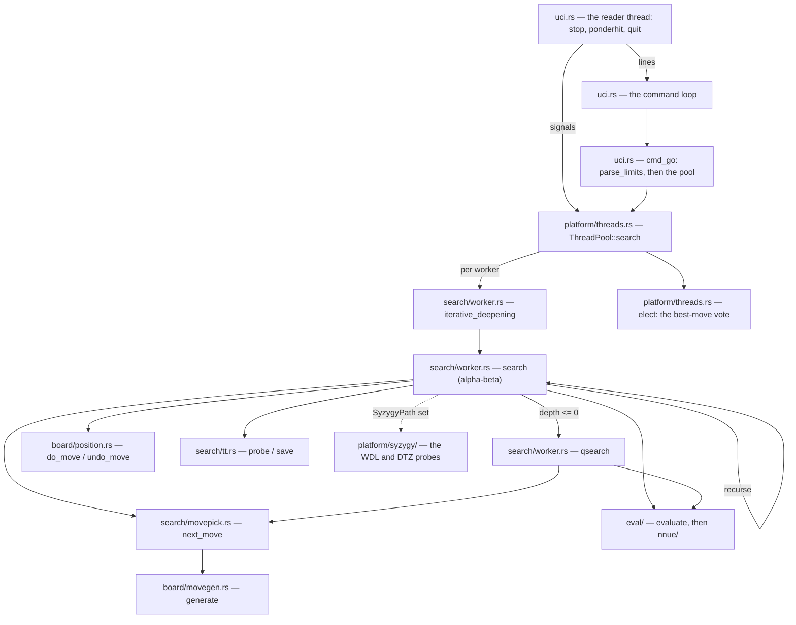

# Architecture

rfish is three crates and five zones. This page is the map; each zone's own page is the
detail.

```
rfish/
  crates/
    rfish-engine/     the ENGINE: no I/O, no UCI, no stdin, no stdout
      src/board/      the value domain, bitboards, attacks, position, movegen
      src/search/     transposition table, histories, move picker, search, time
      src/eval/       the network loader, and the classical scaffolding
      src/state/      the blocks the search and the shell share
      src/platform/   threads, and the Syzygy prober
    rfish/            the SHELL: UCI transport, option model, benchmark. Binary `stockfish`
    xtask/            the build driver and the gate battery
```

## What each module owns

One row per file, so a symbol can be found without a grep. Each zone's own page is the
detail; this is the index into them.

| Module | Owns |
|---|---|
| `board/types.rs` | the value domain: `Color`, `Square`, `Piece`, `Move`, `Value`, the key spaces |
| `board/bitboard.rs`, `board/attacks.rs` | square sets, and the magic and leaper attack tables |
| `board/zobrist.rs` | the hash words, built by a `const fn` at compile time |
| `board/position.rs` | the board, `StateInfo`, `do_move`/`undo_move`, the keys, `see_ge` |
| `board/movegen.rs` | the generators, `perft`, and UCI move notation |
| `board/cuckoo.rs` | van Kervinck's tables: which one move would repeat a position |
| `board/threats.rs` | the threat and pawn-pair features a move creates and destroys |
| `state/mod.rs` | what crosses the zone boundary: `Limits`, `RootMove`, the shared signals |
| `search/worker.rs` | `SearchWorker`, iterative deepening, alpha-beta, quiescence |
| `search/tt.rs`, `search/history.rs` | the shared table, and the ordering and correction tables |
| `search/movepick.rs` | the staged picker |
| `search/timeman.rs`, `search/score.rs`, `search/skill.rs` | the budget, the reported score, the handicap |
| `search/fuzz.rs` | the in-process random-walk soak over the whole spine |
| `eval/nnue/` | the file format, the loader, the accumulator and the forward pass |
| `eval/classical.rs` | the no-net fallback, and scaffolding with a deletion date |
| `platform/threads.rs` | the worker set, the scoped search, the best-move vote |
| `platform/numa.rs` | the topology, upstream's policies, and the distribution report |
| `platform/syzygy/` | discovery, the pairs decoder, the index, and the WDL and DTZ probes |
| `crates/rfish/src/uci.rs` | the transport: the reader thread, the command table, the info lines |
| `crates/rfish/src/options.rs` | the option model and the `uci` handshake |
| `crates/rfish/src/bench.rs`, `crates/rfish/src/speedtest.rs` | the anchor's benchmark, and the throughput report |
| `crates/xtask/src/` | the build driver and every gate |

## Startup

**There is no initialisation order to get wrong, and that is a deliberate difference from
upstream.** Upstream's `main` calls `Attacks::init()` before `Position::init()` because the
second reads the tables the first fills, and getting it backwards does not crash — it reads
zeroed attack sets and presents as a search bug. Here that ordering constraint does not
exist to be violated:

- **Zobrist words are a compile-time constant.** `board/zobrist.rs` builds them in a
  `const fn` behind a plain `static`, so they exist before `main` and cannot be read half
  written. The same is true of the leaper tables and the distance matrix in
  `board/bitboard.rs`.
- **Everything a `const fn` cannot express is a `LazyLock`, built on first read** — the
  magic tables in `board/attacks.rs`, the cuckoo tables in `board/cuckoo.rs` (which are
  keyed by slider attacks, so they cannot precede the magics), and the NNUE threat tables in
  `eval/nnue/features.rs`. A caller cannot forget a hook that does not exist, and a second
  thread cannot observe a half-built table.

What **is** ordered is the network, because it is a runtime input the shell owns rather than
engine state. Both entry paths load it before anything searches: `crates/rfish/src/main.rs`
for the argv form, so `stockfish bench` does not silently measure the fallback, and
`crates/rfish/src/uci.rs` for the interactive form, which also announces it. The binary
resolves the file relative to the working directory, which is why every gate runs the engine
from `resources/`.

**Startup is not free, and no gate in `parity` sees it — but one outside `parity` now does.**
`cargo xtask perf-budget` and `budget-ab` measure a `quit`-only profile, SUBTRACT it from the
search figure, and gate it as a second axis on its own 1% tolerance; the net load and the
magic build are ~1.02e9 instructions against a ~1.51e9 search.
[03-engine-eval.md](03-engine-eval.md) carries that axis, how to measure it, and what two
defects on it looked like — the second was found by the gate's first run.

## How a search flows



`cmd_go` parses the argument list into a `Limits` and hands it to `ThreadPool::search`,
which converts the clock model once for the whole pool and then opens a
`std::thread::scope`. Helpers are spawned into it; **the main worker searches on the calling
thread**, so a single-threaded run involves no spawn at all. Each worker runs
`iterative_deepening` over the same root, recursing through `search` into `qsearch` at depth
zero. Ordering comes from the picker, leaf scores from the NNUE, and the move finally played
is the one `elect` says the pool agrees on — see [04-multithreading.md](04-multithreading.md).

The reader thread is the second edge into the pool and it is not decorative: it owns `stop`,
`ponderhit` and the unbounded-search `quit`, because the command loop is inside the search
while one is running and cannot read them.

**The search allocates nothing per node.** Move lists are fixed arrays, and the stack, the
histories and the accumulator scratch are owned by the worker and reused.
[08-idiomatic-rust.md](08-idiomatic-rust.md) §9 records what three per-node allocations cost
against upstream's zero, and why the obvious fix measured worse than the one that landed.

## The crate boundary is the zone check

The engine crate reads no standard input, writes no standard output and parses no UCI. It
reports through an [`InfoSink`] trait the shell implements.

Upstream needs a link-time check for that property, and the sibling C port runs one as a
gate (`zone-check`: link `engine/` and `platform/` with no `shell/` object and see whether
it resolves). Here it is a crate boundary: `rfish-engine` does not depend on `rfish`, so
the property is checked by `cargo build` on every compile, and a violation is a compile
error rather than a gate someone has to remember to run.

That is the single clearest structural win of the Rust port, and it is worth stating
plainly because it is invisible: **the gate that does not exist is the point**.

## Dependency direction

```
        shell (rfish)
             |
             v
      +-- engine (rfish-engine) --+
      |            |              |
   search        eval         platform
      |            |              |
      +----> state |              |
      |            |              |
      +------------+--> board <---+
```

That is the **declared** direction: `board` reads nothing, `state` reads `board`, `eval` and
`search` read both, `platform` reads all of them, and the shell reads the engine. The
consequence that matters is that **perft is a complete test of the board zone**, because
nothing below it can influence it.

Rust does not enforce it. The crate boundary above is checked by `cargo build`; this graph is
inside one crate, and a cycle between modules of one crate compiles fine. **`cargo xtask
zone-check` enforces it instead**, against a baseline that expires in both directions: an edge
that is not declared reddens the gate, and a declared edge that no longer exists reddens it
too, because a baseline outliving its edge is an excuse. Recompute it rather than trusting the
list — the gate does exactly this, and the reasons below are what it prints:

```sh
cd crates/rfish-engine/src && for z in board state eval search platform; do
    printf '%-9s -> ' "$z"
    grep -rhoE 'use crate::(board|state|eval|search|platform)' "$z"/ |
        sort -u | sed 's/use crate:://' | tr '\n' ' '; echo
done
```

**Four** edges cross the declared direction today, and they are not the same kind of thing.
The fourth is the reason this section now has a gate under it: this page said three, and said
in the same breath that a fourth would be noticed by nobody. One already existed.

- **`board` reads `eval`, in tests only.** `board/threats.rs` checks its recorder against
  `eval/nnue/features.rs`, the encoder that consumes what it records — the two have to agree
  or the accumulator silently reuses a stale feature set, and a differential is the only
  thing that can say so. Every one of these is inside a `#[cfg(test)]` block, so no shipped
  build carries the edge. Keep it that way: the test is worth more than the arrow.
- **`state` reads `search`, and that one is a real cycle.** `state/mod.rs` takes `ContKey`
  and `CorrKey` from `search/history.rs` because a stack frame stores those plane indices,
  while `search` reads `state` for `Limits` and the shared signals. The types are the
  search's, the frame holding them is shared, and closing it means moving the plane index
  types down into `state` or up into `search` along with the frame. **Debt, not design.**
- **`search` reads `platform`.** `search/fuzz.rs` needs a `ThreadPool` to drive a whole
  search, which is the point of the harness. It is declared `pub mod fuzz`, not
  `#[cfg(test)] mod fuzz`, so unlike the first case this edge is compiled into every build.

- **`search` reads `platform` a second time, and this one is not a harness.** `search/worker.rs`
  holds an `Option<Arc<TableRegistry>>` and names `platform::syzygy`'s types in five places, so
  the search's own type depends on the platform zone in every shipped build. Upstream inverts
  this edge with a seam — a small table of function pointers the host fills in — and this port
  does not, which makes it **structural rather than incidental**: closing it is a design change
  with a measurable cost, since the tablebase probe is the one seam that sits on the node path.
  It is recorded rather than fixed, and it is the edge this page did not carry until
  `zone-check` was written.

None of the four is load-bearing for the search. The gate is what notices a fifth: the sibling
C port runs a link-time zone check and the golden runs `depcheck.sh` and `linkcheck.sh` against
a baseline that expires in both directions, and rfish now has the same property from
`cargo xtask zone-check`, in `parity`.

**What it cannot see**: a `use` inside a block comment, and whether an edge is behind
`#[cfg(test)]` — the baseline records which are, because deciding that needs a parser and the
question the gate exists for is whether a FIFTH appears, not how the four are gated.

## Zero dependencies

`rfish-engine` has no crates.io dependencies. Not few — none. `rfish` depends only on
`rfish-engine`; `xtask` depends on nothing.

That is deliberate and reviewed. A chess engine that reproduces upstream's node count byte
for byte must own every line that can move it, and a transitive dependency bump is a
behaviour change nobody reviewed. It also means `cargo build` on a fresh clone compiles
exactly the code in this repository and nothing else.

## No `unsafe`, and one nightly feature

`unsafe_code = "forbid"` is set once, for the whole workspace, in `Cargo.toml`. `forbid`
rather than `deny` so no module can re-enable it locally.

The toolchain is pinned to a **dated nightly** in `rust-toolchain.toml`, for exactly one
feature: `portable_simd`, which the NNUE kernels use. That pin does not weaken the central
property — `std::simd` is **safe**, needs no `unsafe` block, and leaves
`cargo xtask unsafe-lint` asserting the same thing it always did. `std::arch` intrinsics
were the alternative and are refused for the opposite reason: every one of them is an
`unsafe fn`. Nothing else nightly is enabled — not `allocator_api`, not a niche attribute.

The pin is DATED rather than `nightly`, because the instruction mix and every perf number
in the ledger are properties of the compiler and a floating channel would silently
invalidate them.

[docs/08-idiomatic-rust.md](08-idiomatic-rust.md) is the pattern-by-pattern account of what
that costs and what it buys.

## Profiles

| Profile | For | Distinguishing setting |
|---|---|---|
| `dev` | editing | `overflow-checks = true`, `debug = 1` |
| `test` | `cargo test` | `overflow-checks = true` |
| `gate` | `cargo xtask test` | release codegen **plus** debug assertions and overflow checks |
| `release` | shipping and measuring | `lto = "fat"`, one codegen unit, `panic = "abort"` |
| `profiling` | `perf`, callgrind | release plus symbols, `panic = "unwind"` |

The `gate` profile exists because the search states its invariants as `debug_assert!`, and
a release build that skips them turns a violated invariant into a plausible wrong number
rather than a failure. Running the suite under release codegen is also the only way to
catch a bug that only appears optimised.

`release` has `overflow-checks = false` on purpose: upstream relies on wrapping in a handful
of places, and each of those says `wrapping_*` in the rfish source rather than inheriting
the behaviour from a profile. A bare `+` that wraps is therefore a bug, and `gate` is what
catches it.

## What is not here

- **No build system beyond cargo.** `cargo xtask <step>` is the driver; there is no
  Makefile and no shell script. The gates are Rust in the workspace, so they are
  type-checked and clippy-linted by the same CI lane that checks the engine.
- **No embedded network.** The net is a runtime input, fetched by `cargo xtask net` into
  `resources/`. Embedding it would make the bench anchor look like a property of this
  repository rather than of a file downloaded separately.
- **No large-page allocator and no memory mapping**, and **NUMA without PINNING**: the
  topology, the policies and the reporting are in `crates/rfish-engine/src/platform/numa.rs`,
  read from `/sys` and `/proc`; what `std` exposes no API for is binding a thread to a node.
  See [06-platform.md](06-platform.md) for why each gap is blocked rather than pending.

## The gates

The zone split and the `unsafe` prohibition are the two claims on this page that a reader
cannot check by reading, because both are properties of what the tree does NOT contain.

| gate | what it proves here | owned by |
|---|---|---|
| `zone-check` | no engine module names a zone at or above its own, except where a baseline says why | this page |
| `unsafe-lint` | the workspace `forbid` is still there, asserted from OUTSIDE the compiler that enforces it | this page |
| `test` | the whole stack under the gate profile, where `debug_assert!` and overflow checks are on | [10-tooling-ci.md](10-tooling-ci.md) |
| `signature` | the three crates, assembled, search upstream's tree | [10-tooling-ci.md](10-tooling-ci.md) |

### `zone-check` — the direction `cargo` cannot check

```sh
cargo xtask zone-check
```

`rfish-engine`'s five zones have a declared dependency direction — `board` reads nothing,
`state` reads `board`, `eval` and `search` read both, `platform` reads all of them — and the
consequence that matters is that **perft is a complete test of the board zone**, because
nothing below it can influence it. The crate boundary is checked by the compiler; this graph is
inside ONE crate, where a cycle between modules builds fine.

So it was a property a reviewer maintained, and
[00-architecture.md](00-architecture.md) said so: it carried a hand-written inventory of what
crosses, with the note that a fourth edge would be noticed by nobody. **There was already a
fourth** — `search/worker.rs` names `platform::syzygy`'s types in five places, in every shipped
build. The gate found it on its first run, which is the second time in this repository that
writing the instrument was worth more than the finding it was aimed at.

The baseline **expires in both directions**, which is the half that makes a baseline worth
having: an undeclared crossing reddens the gate, and a declared crossing whose edge is gone
reddens it too. Both seen to fail, and `negative-control` carries the first:

```text
UNDECLARED board -> search in board/bitboard.rs: it names a zone at or above its own, ...
STALE search -> platform in search/harness.rs is in the baseline and the edge is gone. ...
```

Each entry's REASON is printed on every run, not merely stored. A baseline nobody reads stops
being questioned; printing it is what keeps each entry something a reader can disagree with.
`../Stockfish refish` keeps `depcheck.sh`'s baselines the same way and its `lanecheck.sh`
prints excuses for the same reason.

### `unsafe-lint`

No `unsafe` keyword, no `allow(unsafe_code)`, and `unsafe_code = "forbid"` still present in
the workspace manifest.

The compiler already rejects the first two. The gate exists because the manifest line is one
line and a reviewer can miss it being deleted — the property is asserted from **outside**
the mechanism that enforces it.

It scans the shipped crates only. `xtask` is a build tool that never enters the binary and
necessarily names the patterns it looks for; scanning it would make the gate report itself.
It is still covered by the workspace forbid, which the manifest check asserts.
