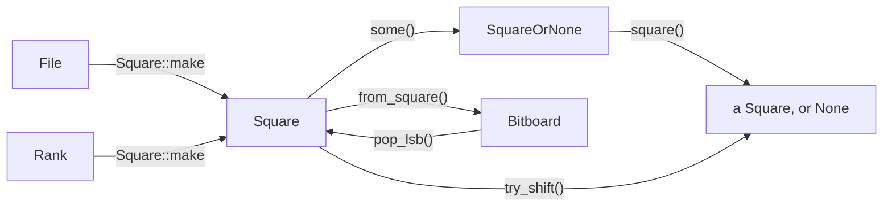
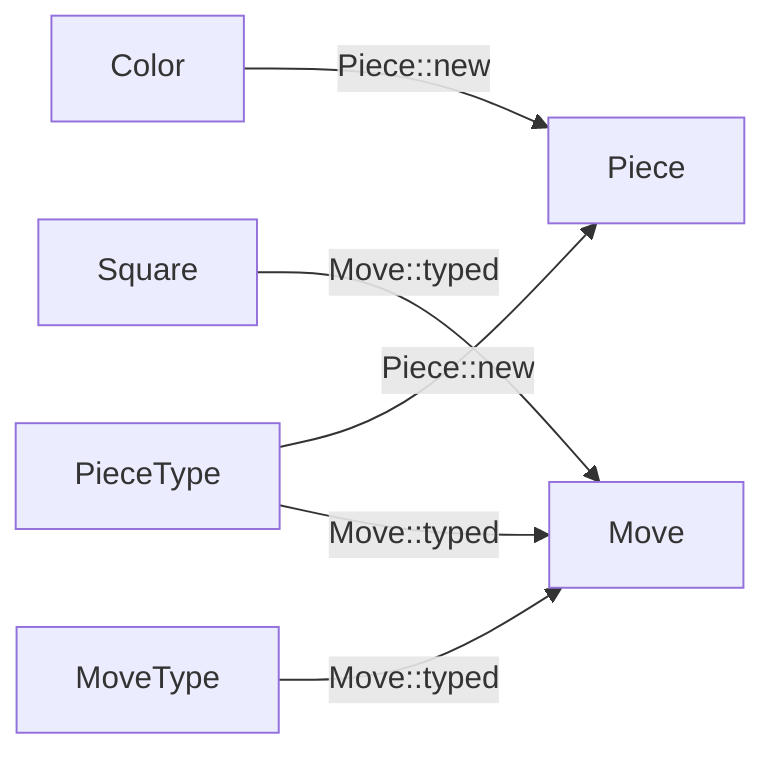
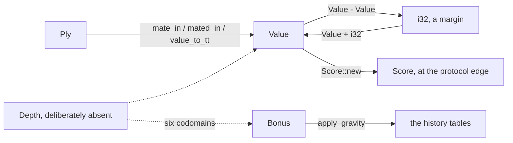
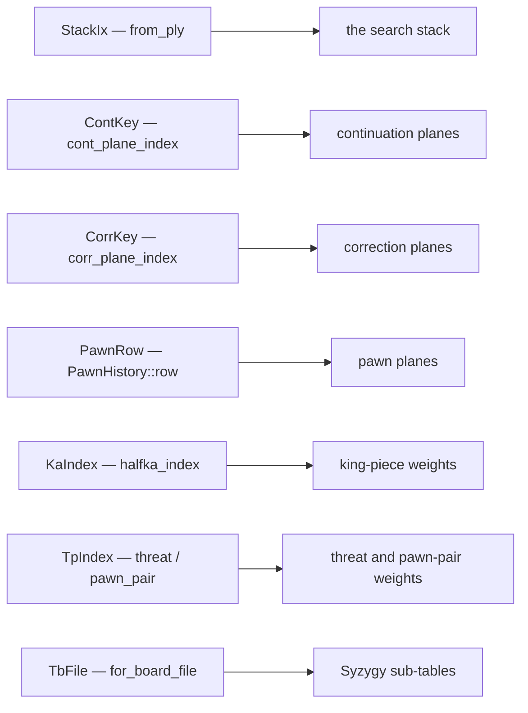
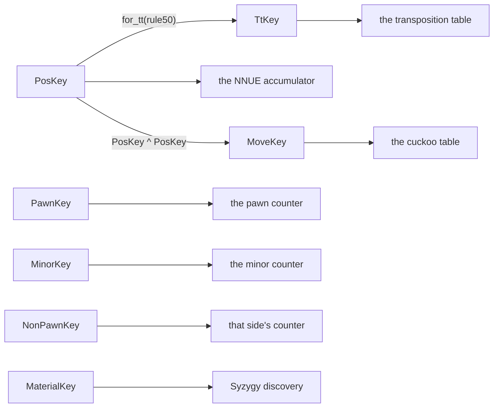

# The value domain

rfish's engine types are not decoration over integers. Each one exists because a *quantity in
chess or in the search has a structure*, and the structure is what the type carries. This page
states that structure — what each family denotes, which algebra it obeys, why it has that
shape rather than another — and closes with the boundary: what these types do not promise.

[08-idiomatic-rust.md](08-idiomatic-rust.md) is the neighbouring page. It records how a C++
construct becomes a Rust one and what each translation measured; this one records what the
resulting values *mean*.

## The premise: a type is a proof that travels

The port forbids `unsafe` everywhere ([00-architecture.md](00-architecture.md)), and that
changes what the type system is for. In a project that permits `unsafe`, a proven-in-range
index has two payoffs — the compiler folds the check, or you write `get_unchecked` and take
the win by assertion. rfish has only the first. **The types are not a safety net over an
escape hatch; they are the only instrument that can discharge a proof at all.**

So the design rule throughout is: when the code knows something, put it where the compiler can
see it. A doc-comment saying "this index is always below 64" is a proof that has evaporated. A
`Square` is the same proof, still there at every call site.

The theory each family rests on is collected in [11-references.md](11-references.md) under
"Type theory and type design", with what each citation is for. This page assumes it.

## What this buys

The return, stated before the design, because a design doc that lists structure without
stating its yield is asking to be taken on faith.

### It closes a class of defect this port is uniquely exposed to

rfish is a bit-exact port, and its hardest bugs are the ones that produce a *plausible wrong
answer* rather than a crash. A swapped argument between two same-typed quantities is exactly
that shape: the engine keeps running, the evaluation is wrong, and the only gate that notices
is the bench signature — which tells you *that* something moved, never *where*.

The types remove the shape rather than the instance. Concretely, each of these compiled before
its type existed and is now a compile error:

| the swap | what it did instead of failing |
| --- | --- |
| a game ply where a search ply belongs | the fifty-move and repetition tests measured from the wrong origin |
| a continuation plane where a correction plane belongs | read a **real** plane of the wrong table — the correction space is a subrange |
| a board file where a Syzygy sub-table index belongs | a confident wrong tablebase verdict |
| a threat index where a king-piece index belongs | folded a different column of the weight table into the accumulator |
| a history bonus where a score belongs | a score-domain number clamped by a history limit |
| a bonus and its clamp, swapped | a differently shaped gravity curve, so a different move ordering |

None of those is hypothetical: each was reachable, and each has been broken on purpose to
confirm the compiler rejects it.

### It finds defects, not only prevents them

Three were found by *introducing* the type, in code that had been reviewed and gated:

- `set_ep_square` took a square straight out of a FEN and stepped it in both pawn directions
  **before** checking its rank, so a record naming a1 or h8 as the en-passant target read back
  a wrapped byte. Splitting `Square` from `SquareOrNone` forced the step to become fallible
  and the bug surfaced as a type error.
- `Limits.ply` and `Position::is_draw(ply)` were both `i32` and both called `ply`, and they
  count from different origins.
- A doc-comment, a `const` assertion and a unit test all insisted `Square::NONE` must be 64
  because a `DirtyPiece` record depended on it. There is no `DirtyPiece` in this engine — the
  accumulator diffs recomputed feature sets. The contract had no holder and the assertion
  defending it proved nothing.

### It pays in performance more often than it costs

This is the part that is genuinely counter-intuitive, so it is stated with mechanisms rather
than adjectives. A type does not make code faster by existing; it makes a *shape* impossible,
and the replacement shape is sometimes better:

- **A fallible accessor beats a step-then-test-twice.** `Square`'s split forced
  `s.shift(d)` followed by an on-board test to become `s.try_shift(d)` returning `Option`,
  which short-circuits before the Chebyshev distance is computed at all. `sliding_attacks`
  runs that loop for every square by every occupancy: **−22.2M instructions in
  `build_magics`**, on the startup axis that `perf-budget` subtracts and no gate in `parity`
  can see.
- **An `Option`-returning accessor reads the field once.** `if ep.is_ok() { … ep.file() … }`
  loads `st.ep_square` twice; `if let Some(ep) = ep.square()` loads it once — **−743K** on the
  `do_move` path.
- **A clamp that belongs to the table can be a const parameter.** Moving `apply_gravity`'s
  limit out of the argument list removed the swap *and* an argument from every history update.
- **Splitting an index space can force a better loop.** `fold_psqt` paired a weight table with
  an index slice at runtime, a shape that only typechecks while both index spaces share a
  type. Writing the two out separately was **−8.08M at sse41**.

And it costs, in one specific and now-understood way — see [the cost rule](#the-cost-rule).
Across the whole domain the ledger is **avx2 +0.37%, sse41 −0.21%**, plus that 22.2M of
startup neither figure includes. The point is not that types are free; it is that the
direction is not predictable from the source and must be measured at both tiers.

### It makes the conversions visible to a reviewer

`grep -rc '\.get()' crates/rfish-engine/src` counts the places a domain value becomes a plain
number: a report to the GUI, a quantisation into `i64`, a pack into a 16-bit transposition
word, an ordering number in the move picker. **Those are the lines a reviewer should look at**,
and before the domain had types they were invisible, because everything was already a number.

## The maps

Four of them rather than one, because the families answer different questions and drawing them
together hides all four. Every solid arrow is a **total function with a name**; none is a cast.
A value crosses a boundary by calling something, and the call is where a reader looks.

### Geometry: how a square is built and taken apart



The two routes into `Opt` are the point. A `Square` is always on the board, so the two ways of
*not* having one — an optional field, and a step that may leave the board — are both explicit
and neither is a sentinel value hiding inside `Square`.

### Material and moves: what packs into what



Both are bit-packings whose widths are load-bearing, and `board/types.rs` asserts each width
against the relationship that implies it rather than against a literal.

### Quantities: the affine ones, and the one that is absent



The two-way arrow through `Margin` **is** the torsor: a difference of scores leaves the score
domain, and only a margin can bring it back. `Depth` is dashed because it does not exist —
its products land in six different codomains, so it has no single one to return.

### Index spaces: one type per table, and no crossings



### Hashes: seven key spaces, and the one conversion between two of them



`for_tt` is the only arrow between two key types, and it is the only place the halfmove clock
is mixed in. Everything else is a distinct space: `PosKey ^ PosKey` leaves the position domain
for the same reason `Value - Value` leaves the score domain, and the four correction keys reach
four counters of one table through four accessors that each take only their own key.

**The absence of crossings is the design.** Seven index types, seven tables, one arrow each,
and each index built by exactly one function. Before the split, five of the seven travelled as
`usize` and two as `u32`, so any of them reached any table. Two of the pairs genuinely overlap
in range — the correction plane space is a subrange of the continuation space, and the
king-piece index space is a prefix of the threat-and-pawn-pair one — which is what makes a
swap read a real entry of the wrong table rather than fail.

## Denotation: a type is a set of values

The frame is the ordinary denotational one. `Square` denotes the 64 squares, `Value` the
search's score domain, `TpIndex` the index set of one weight table. Membership is
construction, so a value of the type *is* a proof that it belongs to the set.

That is why the constructors matter more than the methods, and why they follow one rule in two
tiers:

- **Checked construction** — the argument is a quantity the *caller* computed, so it can be
  computed wrong: `Square::new`, `Square::make`, `File::new`, `Rank::new`,
  `Color::from_index`, `PieceType::from_index`. These panic, and a panic means a corrupt board
  rather than bad input.
- **Raw reconstruction** — the argument is an encoding *this module produced*, read back out
  of a packed record: `Move::from_raw`, `Piece::from_raw`, `CastlingRights::from_raw`,
  `Bound::from_raw`, `Bitboard::from_bits`. Total where every bit pattern is a valid encoding,
  `debug_assert`-ed where it is not.

**Neither tier masks.** A mask under a name that reads lossless turns a corrupt byte from a
transposition entry or a table file into a plausible piece — a wrong answer rather than a
detected fault. Every caller already narrows the value before the call, so the mask bought
nothing at either end.

`PieceType::from_low3` is a third shape and not an exception: total over the three bits it
names, table-backed so it has no panic arm to branch on. It is table-backed because its
mapping is *not* the identity — 7 maps to `None`, which no mask produces. `Bound::from_raw` is
deliberately not table-backed, because its discriminants are 0..=3 in order, so the match
compiles to the mask alone and a table would only add a load.

## Quantities: scores and plies are torsors

The most load-bearing piece of theory here. A score, a ply and a game ply are **affine**
quantities — points in a space with no meaningful origin — and the algebra that describes them
is a **torsor**: subtract two points to get a displacement, translate a point by a
displacement, but never add two points.

That is exactly `Value`'s operator set:

```rust
Value - Value  ->  i32     // a MARGIN: the displacement between two scores
Value +/- i32  ->  Value   // translation by a margin
Value * i32    ->  Value   // scaling
// no Add<Value>, no From<i32>
```

`std` models the same structure and is the reference instance worth reading: `Instant -
Instant` is a `Duration`, `Instant + Duration` is an `Instant`, and there is no `Instant +
Instant`. `Ply` and `GamePly` are two more — a ply difference is a distance, not a ply, and
the two counters measure from different origins: one from the root of the current search, the
other from the start of the game.

**Why this earns its keep rather than being an elegance.** The search is full of margins — a
futility margin, an aspiration delta, a razoring threshold. Before the split they were the
same type as the scores they were compared against, and `value_from_tt(v, ply, rule50)` took
two adjacent `i32`s carrying different units. The torsor algebra makes a margin a distinct
type without a second newtype, because the *difference operator* produces it.

Three places genuinely sum two scores — the NNUE psqt and positional heads, and two weighted
blends toward beta. Those are components of one score rather than two scores, and each says
`Value::new` at the line where that is decided. `Add<Value>` is absent so that all three are
visible.

## Quantities: what a history bonus is

`Bonus` is a different quantity from `Value`, and it is not affine. It is an *update* to a
history table: clamped to that table's limit, produced by a depth-scaled formula, meaningless
outside `apply_gravity`'s rule. Its operators are scale, divide, negate and compare, and there
is no `Add<Bonus>` because two bonuses are never summed — they are applied one after the
other.

The table's clamp is a **const parameter** of `apply_gravity`, not an argument, and that is a
design decision rather than a convenience. The clamp belongs to the table; every caller passed
its own table's constant; and while it travelled beside the bonus the two adjacent `i32`s were
interchangeable. A swap there does not fail — it clamps by one and divides by the other,
producing a differently shaped gravity curve and a different move ordering.

## Why there is no `Depth`

Deliberate, for upstream's own reason. A depth-scaled product feeds at least six different
codomains:

| expression | scales into |
| --- | --- |
| `(133 * depth - 81).min(1487)` | a `Bonus` |
| `alpha - 483 - 318 * depth * depth` | a `Value` margin |
| `beta - 13 * depth - 47 * i32::from(improving) + 365` | a `Value` margin |
| `(3 + depth * depth) / (2 - i32::from(improving))` | a move COUNT |
| `history < -4136 * depth` | a history magnitude |
| `r += r * 276 / (256 * depth + 268)` | a reduction denominator |

A `Mul` impl has exactly one `Output`. Any single choice leaves the other five needing an
unwrap, and the choice that serves all six — `Mul<i32> for Depth -> i32` — turns any depth
into any integer by multiplying by one, which is the escape hatch the type was for.
**A newtype that needs six output types is a newtype that needs none.** `using Depth = int`
exists upstream for the same reason.

Units-of-measure systems solve this with unit polymorphism, where a function can be generic in
the unit it returns. Rust's operator traits cannot express that, so the honest answer is to
leave depth a scalar and say why.

## Index spaces: a bound the compiler can see

Four families, and the design question is the same for each: *which set does this integer
index, and can the compiler tell?*

- **`StackIx`** — a slot in the search stack. This is the port's own addressing: where
  upstream walks a `Stack*` pointer, rfish carries an index, because a pointer does not
  survive borrow checking while `&mut self` is live
  ([08-idiomatic-rust.md](08-idiomatic-rust.md)). That makes it the one piece of addressing no
  upstream diff can check, which is precisely why it earns a type. The lookback is `back(n)`
  rather than `-`, so walking back up the line is a named operation; `pre_root(i)` is separate
  because the sentinel slots below the base hold no node.
- **`ContKey`, `CorrKey`, `PawnRow`** — three flat plane indices into three
  `PieceToPlane`-shaped tables. Three types rather than one because the correction space is a
  *subrange* of the continuation space: a swap reads a real plane of the wrong table and never
  panics.
- **`KaIndex`, `TpIndex`** — the two NNUE feature index spaces. `halfka_index` addresses the
  king-piece weight table; `threat_index` and `pawn_pair_index` address a second, shared
  table. `TpIndex::pawn_pair` adds the base and is the only thing that does, so the
  concatenation of the two feature blocks is a property of the constructor rather than a
  coincidence a test asserts. `TpIndex::threat` is deliberately **total**: `threat_index`
  returns an out-of-range value for a combination that names no feature, and the caller drops
  those rather than branching per piece kind, which is upstream's shape.
- **`TbFile`** — which of a pawnful Syzygy table's four per-file sub-tables a position uses.
  Not a `File`: a board file is one of eight, a `TbFile` one of four, and
  `TbFile::for_board_file` is the only route between the spaces.

Where a bound can be a *compile-time constant* rather than a type, it is: `Box<[T; N]>` for
the search stack and the reduction table, `propagate<const N>` in the layers. Same idea one
level down — a length the compiler knows folds the check — and
[08-idiomatic-rust.md](08-idiomatic-rust.md) records both where it paid and where it did not.

## The sentinel split, and illegal states

`Square` is always a real square, 0..=63. "A square, or nothing" is `SquareOrNone`, a
different type. They were one type with a 65th value, which made `is_ok()` a runtime test
every consumer had to remember — and the consumers are the en-passant target, the castling
rook table and the search's previous-move square, all genuinely optional.

The same principle at the protocol edge: `Score` is three variants — a mate distance, a
tablebase verdict, an ordinary evaluation — rather than one number with magic magnitudes. A
decisive score must not be blended, widened or scaled, because it is a fact rather than an
estimate, and three variants make that unwriteable rather than merely discouraged.

Two supporting shapes deserve naming, because they are invariants held by *structure* rather
than by checks:

- `Aligned<T>` exposes no resize API, because a reallocation would move the base and strand
  the offset. The invariant is maintained by what the type does not let you do.
- `Line<T>` is `#[repr(align(64))]` with a `Deref`, so a cache-line requirement is a property
  of the type rather than a hope about the allocator.

## What a compile error stops

Each of these was a shape the code accepted before its type existed, and each has been made to
fail on purpose.

- A ply where a game ply belongs, and the reverse.
- A margin where a score belongs; a raw integer entering the score domain without a visible
  `Value::new`.
- A history bonus where a score belongs, and any other integer in scope reaching a history
  update.
- A continuation plane index where a correction plane index belongs.
- A ply where a stack slot belongs.
- A board file where a Syzygy sub-table index belongs.
- A threat feature index where a king-piece feature index belongs, at the fold boundary.
- An off-board square: a step that may leave the board is `try_shift`, returning `Option`.
- A tablebase verdict blended like an estimate.
- A raw position key where a transposition key belongs. The two differ by the halfmove-clock
  mixing, and probing with the unmixed one made positions share an entry the fifty-move rule
  invalidates — the "key identity" bug class, which no perft can see.
- A position key where a move key belongs, or a material key where either belongs.
- A correction row selected by one key and read through another key's counter.
- A widened domain type. `board/types.rs` closes with a `const` block asserting each width
  against the *relationship* that implies it, so the assertion cannot go stale:
  `PIECE_NB == COLOR_NB * 8` because a piece is `colour << 3 | type`, and
  `SQUARE_NB == u64::BITS` because a bitboard is one bit per square.

## What a compile error does NOT stop

A page that omits its own boundary invites over-trust, and twenty types are exactly the kind
of thing that invites it.

**A wrong index that is in range.** Every index type here is a newtype over an integer, not a
refinement over a range. `ContKey` stops a correction plane reaching the continuation table;
it does not stop the *wrong* continuation plane reaching it. The Syzygy prober is the sharpest
case — an index computed one off there returns a confident wrong verdict, and `TbFile` narrows
which space the index lives in, not which entry.

**Anything inside a fold.** `fold_psqt` indexes two weight tables with the same element type,
so a `TpIndex` used against the king-piece rows still compiles *within* that function. The
protection is at the call boundary, where the two slice pairs are arguments.

**The four bug classes that cost this port the most.** None is a typing problem and all four
are invisible to perft: C++'s signed-to-unsigned conversion changing a division from
truncating to flooring; two generators emitting the same set in a different *order*; a key
that omits the halfmove clock past move 14; a state update that "obviously" belongs and does
not. [08-idiomatic-rust.md](08-idiomatic-rust.md) owns those.

**A niche.** `Option<Square>` is two bytes, not one. Giving `Square` a niche needs either a
64-variant enum — whose construction sits on `Bitboard::pop_lsb`, the hottest line in the
engine — or an unstable feature, since the mechanism `NonZero` uses requires `unsafe` to
construct and this workspace forbids it.

**Cost.** A type is not free here, and the direction is not predictable from the source.

## The cost rule

Measured across the whole domain, at two `--arch` tiers, with `cargo xtask perf-budget`:

> **A newtype is free while the value is CARRIED — produced, stored, passed, indexed with. It
> can cost when many instances are LIVE AT ONCE inside one large function**, because that is a
> register-allocation problem and the wrapper perturbs it.

The costly cases share a shape: a scalar threaded through the control flow of a function big
enough to dominate the profile, where the cost appears as extra `mov` instructions with no
attributable symbol and no inline attribute that addresses it. The free cases are indices
carried in a `Vec` and consumed one at a time, coordinates passed to a table lookup, and every
repr-preserving rename.

Two practical consequences:

- **Measure a type change at both tiers.** `signature` proves it is bit-exact and says nothing
  about cost; `perf-budget` is the gate that sees it, and a change can improve one tier while
  regressing the other.
- **When a type split forces a loop to be rewritten, measure the split and the rewrite
  separately.** They are different changes with different justifications, and the rewrite is
  usually the whole movement. [10-tooling-ci.md](10-tooling-ci.md) has the instruments,
  including how to get release codegen with symbols so a diff has something to attribute to.

## Adding a type

1. Say which set it denotes, and give it constructors that are the only way into that set.
2. Give it the algebra the quantity actually has, and no more. An operator added because it is
   convenient is an operator that will be used where it should not be.
3. Do not give it `From<the underlying integer>`. A conversion should be a place a reader can
   see.
4. Make the mutation fail: break the code on purpose in the way the type is meant to stop, and
   check that the compiler rejects it. A type that has not been seen to reject something is a
   claim, not a guarantee.
5. Run `cargo xtask signature`, then `cargo xtask perf-budget` at both tiers.
6. Add a row here — to the map, to the boundary, or to both. A type added without one makes
   this page quietly wrong.
